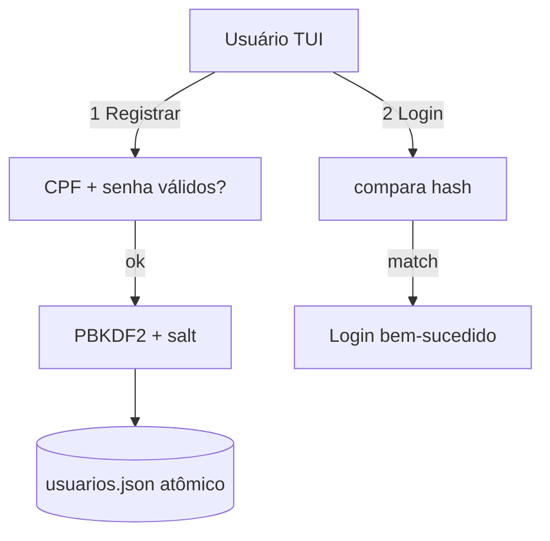

# 👤 gerenciador-usuarios-tui — Usuários com Senhas em PBKDF2
<p align="center">
  
  <a href="https://github.com/panda12332145/gerenciador-usuarios-tui/commits/main"></a>
  <a href="https://github.com/panda12332145/gerenciador-usuarios-tui"></a>
  
</p>
---
## 🔖 Resumo

**Gerenciador de usuários em TUI portátil** (só `input`/`print`, sem root nem libs de teclado) com validação real de **CPF** (algoritmo dos dígitos verificadores), política de senha (maiúscula+minúscula+número+especial) e armazenamento com **PBKDF2-SHA256 + salt aleatório (100k iterações)** — as senhas **nunca tocam o disco em claro**. Arquivo de dados configurável por variável de ambiente (fácil de testar).

### ✨ Funcionalidades Principais

- ✅ CPF validado pelos 2 dígitos verificadores (rejeita repetidos/curtos)
- ✅ Senha forte: 4 classes de caractere obrigatórias
- ✅ **PBKDF2-SHA256 + salt por usuário (100k)** — zero texto puro no JSON
- ✅ TUI portátil: menu numerado com `input()` (funciona em qualquer terminal)
- ✅ Persistência atômica (tmp + `os.replace`) — nunca corrompe o arquivo
- ✅ `GERENCIADOR_ARQUIVO` para apontar o banco (testes/múltiplos usuários)

## 📽 Demonstração

```text
$ python main.py
###############################
#   Gerenciador de Usuários   #
###############################
  1. Registrar
  2. Login
  3. Sair
Escolha [1-3]: 1
Digite seu nome: Ana
Digite sua senha: Abc123!xyz
Digite seu CPF (apenas números): 52998224725
Usuário registrado com sucesso!
```

## ⚙️ Explicação das Partes Importantes

### Hash de senha (`src/users.py`)

```python
salt = secrets.token_bytes(16)                  # único por usuário
dk = hashlib.pbkdf2_hmac("sha256", senha.encode(),
                         salt, 100_000)          # ~0,1s de ataque por chute
# disco guarda: senha_hash + salt — nunca a senha
```

> PBKDF2 torna cada chute caro; salt individual impede rainbow tables. Um dump do JSON não revela nenhuma senha.

### Validação de CPF

```python
for i in (9, 10):                    # 1º e 2º dígitos verificadores
    soma = sum(int(cpf[num]) * peso
               for num, peso in enumerate(range(i + 1, 1, -1)))
    digito = (soma * 10) % 11
    ...
```

> Implementação oficial da Receita — cobre CPFs reais e rejeita os 11 dígitos repetidos.

## 🔄 Fluxo de Trabalho / Arquitetura



## 📂 Estrutura do Projeto

```plaintext
gerenciador-usuarios-tui/
├── main.py               # entrada da TUI
├── src/
│   ├── users.py          # regras: CPF, senha, PBKDF2, arquivo
│   └── tui.py            # menu portátil
├── tests/test_users.py   # 5 testes
├── requirements.txt      # stdlib pura
└── README.md
```

## 🛠️ Tecnologias

| Ferramenta | Uso |
|---|---|
| **Python 3** | Linguagem |
| **hashlib.pbkdf2_hmac** | Hash de senha |
| **json** | Persistência |
| **secrets** | Salts aleatórios |

## ▶️ Instalação

```bash
git clone https://github.com/panda12332145/gerenciador-usuarios-tui.git
cd gerenciador-usuarios-tui
# só stdlib — nada para instalar
```

## 🚀 Execução

```bash
# TUI:
python main.py

# Banco em outro local:
GERENCIADOR_ARQUIVO=/tmp/usuarios.json python main.py

# Testes:
python tests/test_users.py
```

## 🧪 Testes

5 testes automatizados: CPFs válidos/inválidos (DV errado, repetido, lixo), política de senha, fluxo registro/login, prova de que a senha NUNCA aparece no JSON e validações de duplicado/erro.

## ⚠️ Limitações

- Sem criptografia no arquivo inteiro (só hash de senha)
- Sem MFA/recuperação de senha (lab)
- Um arquivo por usuário logado — sem concorrência de escrita pesada

## 🚀 Roadmap

- [ ] Argon2id como alternativa ao PBKDF2
- [ ] Export/import do banco cifrado
- [ ] Listagem de usuários na TUI

## 📄 Licença

Todos os direitos reservados ao autor.

---

## 👾 Autor

<p align="center">
  
</p>

<p align="center">Feito por <strong>Panda12332145</strong> 👋🏽</p>

---

## 🧑‍💻 Sobre Mim

Sou apaixonado por **Física Teórica, Cibersegurança e Desenvolvimento de Sistemas**. Tenho grande interesse em programação de baixo nível, engenharia reversa, automação, sistemas Windows, criptografia e segurança ofensiva. Também gosto bastante de música, filosofia e computação avançada.

---

## 🌐 Redes

* **Site:** [https://panda-h0me.netlify.app/](https://panda-h0me.netlify.app/)
* **YouTube:** [https://www.youtube.com/@X86BinaryGhost](https://www.youtube.com/@X86BinaryGhost)
* **Instagram:** [https://www.instagram.com/01pandal10/](https://www.instagram.com/01pandal10/)
* **GitHub:** [https://github.com/panda12332145](https://github.com/panda12332145)
* **LinkedIn:** [linkedin.com/in/athos-da-boanergis](https://www.linkedin.com/in/athos-d%C3%A3-boanergis-5585a4288/)

---

## 🚀 Áreas de Interesse

* **Cibersegurança Avançada** 🔒
* **Hacking & Engenharia Reversa** 💻
* **Computação de Baixo Nível** 🖥️
* **Matemática e Física Teórica** 📐⚛️
* **Desenvolvimento de Ferramentas de Segurança** 🛠️

_"Conhecimento é poder, e domínio técnico vem da compreensão profunda dos sistemas."_

---

## 📞 Contato & Suporte

Para colaborações, dúvidas ou sugestões:

📧 **E-mail:** [athos.cybersec@gmail.com](mailto:athos.cybersec@gmail.com)

🐛 **Reportar Bug:** [Abrir Issue](https://github.com/panda12332145/gerenciador-usuarios-tui/issues)

💡 **Sugerir Melhoria:** [Discussions](https://github.com/panda12332145/gerenciador-usuarios-tui/discussions)
